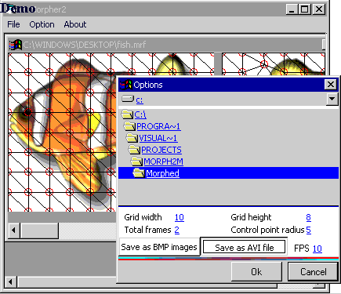

## VBMorpher2

### Description

THIS PROJECT IS A MUST SEE!. Ever wanted to create morphing movies like you see on tv, well now its possible. This project is an improvement to my last Morphing program submission. With this version, you can create an AVI video file of your morph, or you can choose to save it frame by frame. My last attempt a morphing produced excellent resulte but was rather slow, this one produces much better results and the speed is simply LIGHTNING. Just look and see!
 
### More Info
 

             |
---                |---
**Submitted On**   |2000-05-17 11:47:38
**By**             |[Niranjan Paudyal](https://github.com/Planet-Source-Code/PSCIndex/blob/master/ByAuthor/niranjan-paudyal.md)
**Level**          |Intermediate
**User Rating**    |4.9 (230 globes from 47 users)
**Compatibility**  |VB 5\.0, VB 6\.0
**Category**       |[Graphics](https://github.com/Planet-Source-Code/PSCIndex/blob/master/ByCategory/graphics__1-46.md)
**World**          |[Visual Basic](https://github.com/Planet-Source-Code/PSCIndex/blob/master/ByWorld/visual-basic.md)
**Archive File**   |[VBMorpher21561053172003\.zip](https://github.com/Planet-Source-Code/niranjan-paudyal-vbmorpher2__1-44075/archive/master.zip)

